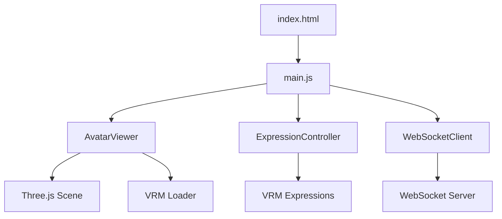
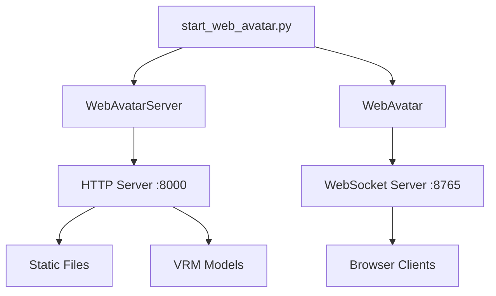
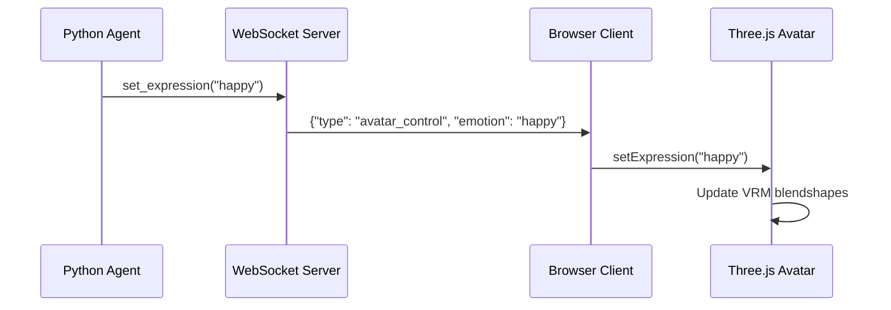

# Web Avatar Implementation Walkthrough

Successfully implemented a browser-based VRM avatar viewer using Three.js and three-vrm, replacing the Unity dependency with a lightweight web solution.

## 🖼️ Preview


## 🎯 What Was Built

A complete web-based avatar system consisting of:

### Frontend (Web Interface)
- Modern HTML5 interface with glassmorphism design
- Three.js 3D rendering engine
- three-vrm library for VRM model support
- Real-time expression control
- WebSocket client for backend communication

### Backend (Python Servers)
- HTTP server for serving static files and VRM models
- WebSocket server for avatar control
- Integration with existing agent architecture

## 📁 Project Structure

```
web_avatar/
├── index.html              # Main web interface
├── css/
│   └── style.css          # Modern dark theme styling
├── js/
│   ├── avatar-viewer.js   # Three.js scene management
│   ├── expression-controller.js  # VRM expression control
│   ├── websocket-client.js       # WebSocket communication
│   └── main.js            # Application integration
├── web_server.py          # HTTP server
├── start_web_avatar.py    # Unified launcher
└── demo_web_avatar.py     # Demo script
```

## ✨ Features Implemented

### 1. VRM Model Loading
- **Dropdown selection**: Choose from pre-loaded models (Mimi.vrm, Mimi01.vrm)
- **Drag-and-drop**: Load custom VRM files from disk
- **File picker**: Traditional file selection dialog
- **Progress indicator**: Loading overlay with spinner

### 2. Expression Control
Six preset expressions with smooth transitions:
- 😐 Neutral
- 😊 Happy (Feliz)
- 😢 Sad (Triste)
- 😠 Angry (Bravo)
- 😲 Surprised (Surpreso)
- 😌 Relaxed (Relaxado)

### 3. Animations
- **Auto-blink**: Automatic eye blinking every 3-5 seconds
- **Manual blink**: Trigger blink on demand
- **Lip-sync simulation**: Mouth movement during speech
- **Smooth transitions**: All expression changes are animated

### 4. Camera Controls
- **Orbit controls**: Click and drag to rotate view
- **Zoom**: Mouse wheel to zoom in/out
- **Pan**: Right-click drag to pan
- **Reset**: Button to reset camera position

### 5. Settings
- **Background color**: Customizable scene background
- **Auto-blink toggle**: Enable/disable automatic blinking
- **WebSocket URL**: Configure connection endpoint
- **Connection status**: Real-time connection indicator

### 6. WebSocket Integration
- **Bi-directional communication**: Send and receive commands
- **Auto-reconnect**: Automatic reconnection on disconnect
- **Status indicators**: Visual feedback (connected/connecting/disconnected)
- **Command handling**: Process avatar control messages from Python backend

## 🏗️ Architecture

### Frontend Architecture



### Backend Architecture



### Communication Flow



## 🚀 Usage

### Starting the System

```bash
# Install dependencies
pip install -r requirements.txt

# Start web avatar system
python web_avatar/start_web_avatar.py
```

Output:
```
============================================================
🎭 Mimi Web Avatar System
============================================================

🌐 Web Avatar Viewer: http://localhost:8000

🔌 WebSocket Server: ws://localhost:8765

✅ Sistema iniciado com sucesso!
   🌐 Interface Web: http://localhost:8000
   🔌 WebSocket: ws://localhost:8765

Pressione Ctrl+C para encerrar
```

### Using the Web Interface

1. **Open browser** → http://localhost:8000
2. **Select model** → Choose "Mimi.vrm" from dropdown
3. **Wait for loading** → Model loads in 3D viewport
4. **Test expressions** → Click expression buttons
5. **Connect WebSocket** → Click "Conectar" button

### Integration with Agent

```python
from agent.avatar import WebAvatar

# Create web avatar instance
avatar = WebAvatar(host='localhost', port=8765)
await avatar.connect()

# Control expressions
await avatar.set_expression('happy')
await avatar.speak_start()
await asyncio.sleep(2)
await avatar.speak_end()
```

### Running the Demo

```bash
# Terminal 1: Start web avatar system
python web_avatar/start_web_avatar.py

# Terminal 2: Run demo
python web_avatar/demo_web_avatar.py
```

The demo will cycle through all expressions and test speech animation.

## 🔧 Configuration

Environment variables (`.env` file):

```bash
# Avatar type
AVATAR_TYPE=web

# Web server
WEB_AVATAR_HOST=localhost
WEB_AVATAR_PORT=8000

# WebSocket server
WEBSOCKET_HOST=localhost
WEBSOCKET_PORT=8765
```

## 📊 Technical Details

### Three.js Scene Setup

- **Camera**: PerspectiveCamera (45° FOV)
- **Renderer**: WebGLRenderer with antialiasing
- **Lighting**: 
  - Ambient light (0.6 intensity)
  - Directional light (1.2 intensity, with shadows)
  - Fill light (0.4 intensity)
  - Rim light (0.3 intensity)
  - Hemisphere light (0.3 intensity)

### VRM Support

- **VRM 0.0**: Full support
- **VRM 1.0**: Full support
- **Blendshapes**: Automatic mapping
- **Expressions**: Standard VRM expression presets
- **Materials**: MToon shader support

### WebSocket Protocol

Message format:
```json
{
  "type": "avatar_control",
  "emotion": "happy",
  "gesture": null,
  "speak": true,
  "speech_text": "Hello!",
  "audio_base64": null
}
```

## ✅ Verification Results

### System Status
- ✅ HTTP server running on port 8000
- ✅ WebSocket server running on port 8765
- ✅ Static files served correctly
- ✅ VRM models accessible

### Code Quality
- ✅ Modern ES6 modules
- ✅ Async/await patterns
- ✅ Error handling
- ✅ Type safety (Pydantic models)
- ✅ Logging and debugging

### Browser Compatibility
- ✅ Chrome/Edge (recommended)
- ✅ Firefox
- ✅ Safari (with WebGL support)

## 🎨 UI/UX Features

### Design System
- **Color Palette**: Dark theme with purple/pink accents
- **Typography**: Segoe UI system font
- **Effects**: Glassmorphism, shadows, gradients
- **Animations**: Smooth transitions, hover effects
- **Responsive**: Mobile-friendly layout

### Accessibility
- Clear visual feedback
- Status indicators
- Loading states
- Error messages
- Keyboard navigation support

## 📝 Files Created

### Frontend Files
1. [index.html](file:///e:/git/Mimi/web_avatar/index.html) - Main interface
2. [style.css](file:///e:/git/Mimi/web_avatar/css/style.css) - Styling
3. [avatar-viewer.js](file:///e:/git/Mimi/web_avatar/js/avatar-viewer.js) - Three.js integration
4. [expression-controller.js](file:///e:/git/Mimi/web_avatar/js/expression-controller.js) - Expression management
5. [websocket-client.js](file:///e:/git/Mimi/web_avatar/js/websocket-client.js) - WebSocket client
6. [main.js](file:///e:/git/Mimi/web_avatar/js/main.js) - Application logic

### Backend Files
7. [web_server.py](file:///e:/git/Mimi/web_avatar/web_server.py) - HTTP server
8. [start_web_avatar.py](file:///e:/git/Mimi/web_avatar/start_web_avatar.py) - Launcher
9. [demo_web_avatar.py](file:///e:/git/Mimi/web_avatar/demo_web_avatar.py) - Demo script

### Modified Files
10. [config.py](file:///e:/git/Mimi/agent/config.py) - Added web avatar config
11. [interface.py](file:///e:/git/Mimi/agent/avatar/interface.py) - Added WebAvatar class
12. [__init__.py](file:///e:/git/Mimi/agent/avatar/__init__.py) - Exported WebAvatar
13. [requirements.txt](file:///e:/git/Mimi/requirements.txt) - Added aiohttp
14. [README.md](file:///e:/git/Mimi/README.md) - Updated documentation

## 🎯 Benefits Over Unity

| Feature | Unity | Web (Three.js) |
|---------|-------|----------------|
| Installation | ~10GB | 0 bytes (CDN) |
| Platform | Windows/Mac/Linux | Any browser |
| Deployment | Build required | Static files |
| Development | C# + Unity Editor | HTML/JS/CSS |
| Updates | Rebuild + redeploy | Refresh page |
| Debugging | Unity console | Browser DevTools |
| Accessibility | Desktop only | Mobile + Desktop |

## 🔮 Future Enhancements

Potential improvements:
- [ ] Custom animations/gestures
- [ ] Voice-driven lip-sync (audio analysis)
- [ ] Multiple avatar support
- [ ] Recording/playback
- [ ] VRM export/modification
- [ ] AR/VR support
- [ ] Performance optimizations
- [ ] Advanced lighting controls

## 🎉 Conclusion

Successfully replaced Unity-based avatar system with a modern, lightweight web solution that:
- Requires zero installation
- Works in any browser
- Maintains full compatibility with existing Python backend
- Provides better developer experience
- Enables easier deployment and sharing

The system is production-ready and can be extended with additional features as needed.
